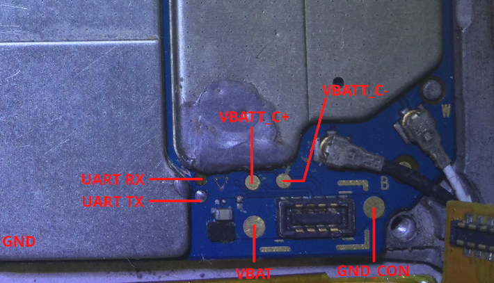

# UART
:::warning
Be extremely careful when removing the protective metal shield.

Let's pay tribute to [Roger Ortiz](https://github.com/R0rt1z2), whose phone died during testing.
:::


## Preparing
On Motorola's production devices, access to UART has been intentionally restricted as part of "perceived security" measures. 

To enable UART, it is necessary to remove the protective metal shield and solder 1K resistors to the UART lines to restore the functionality of the test points.

:::info
Alternatively, a tiny tin bridge can be used, which will function the same as 1K resistors.
:::


## Testpoints


## Getting logs
If you're using Linux, it's recommended to use [`tio`](https://github.com/tio/tio) to grab logs from UART. If you're using Windows, you can use [PuTTY](https://www.putty.org/) or any other terminal emulator.

You'll need a cheap USB to UART adapter, such as the [FT232RL](https://ftdichip.com/products/ft232rl/) (AliExpress has clones for $1 or less). You have to connect the phone's TX to the adapter's RX, the phone's RX to the adapter's TX, and the phone's GND to the adapter's GND.

The first boot stage, BROM, will output startup logs at `115200` baud rate. After the BROM stage, the baud rate will change to `921600` and will remain at that speed until the phone is fully booted (as soon as the phone reaches the lock screen / home screen UART logs will stop).

:::warning
By default, UART logs aren't complete. To get full logs, you have to hold both volume keys while booting the phone. If you don't, you'll be greeted with a `Log Turned Off.` message.
:::

## Samples
### BROM logs
```plaintext
F0: 102B 0000
F3: 0000 0000 [0200]
V0: 0000 0000 [0001]
00: 0007 8000
01: 0000 0000
BP: 0800 0209 [0000]
G0: 0090 0000
EC: 0000 0000 [0000]
CC: 0000 0000 [0005]
T0: 0000 0078 [000F]
Jump to BL
```

BROM logs can be parsed and translated to human-readable format resulting in the following:
```plaintext
F0: 102B 0000
 - 0: Boot mode ID: RAM
 - 102B: Most recent status code: 0x102b
 - 0000: Previous status code: 0x0000
F3: 0000 0000 [0200]
 - 3: Boot mode ID: MSDC0 (eMMC)
 - 0000: Most recent status code: 0x0000
 - 0000: Previous status code: 0x0000
V0: 0000 0000 [0001]
 - 0: Bootloader descriptor index: 0
 - 0000: Most recent status code: 0x0000
 - 0000: Previous status code: 0x0000
 - 0001: Bootloader descriptor bl_type: ARM_BL
00: 0007 8000
 - 00: Message counter: 0
 - 0007: Status code: 0x0007
 - 8000: Extra context-specific data: 0x8000
01: 0000 0000
 - 01: Message counter: 1
 - 0000: Status code: 0x0000
 - 0000: Extra context-specific data: 0x0000
BP: 0800 0209 [0000]
 - 0800 0209: Flags
   - Preloader found on boot medium.
   - JTAG is disabled.
   - SEJ + 0xc0 (SEJ_CON1) bits [11:8] are not clear.
   - USB DL HS (High Speed?) enabled.
 - 0000: Preloader offset: 0 bytes
G0: 0090 0000
 - 0090: Lower 16 bits of the BROM config flags.
 - 00: USB DL bulk communications support: 0
 - 00: BROM config reserved1: 0
EC: 0000 0000 [0000]
CC: 0000 0000 [0005]
T0: 0000 0078 [000F]
 - 0000 0078: BROM execution time: 120 ms
 - 000F: JTAG delay % 65536: 15 ms
```